# Training Dynamics of Different Loss functions

This repository contains experiments designed to study how different training objectives influence pretraining and post-training learning dynamics in a toy setting. In this setup, both the data and the model are Gaussian Mixture Models (GMMs).

Our goal is to gain a little bit insight into how these objectives may behave in large-scale language model training.

We explore the following loss functions.

$p$ is the true data distribution, $q_\theta$ is the model distribution. And we assume data distributin $p$ is **unknown**, but we've got samples from $p$.

## Loss Functions

### (1) Negative Log-Likelihood (NLL)

$$\text{minimize} -\mathbb{E}\_{x_i \sim p}[\log q_\theta(x_i)]$$

This loss function is equivalent to minimizing the forward KL divergence between data and model distritions.

$$\text{KL}(p||q_\theta) = \mathbb{E}\_{x_i \sim p } [\log(\frac{p(x)}{ q_\theta(x) })] = \mathbb{E}\_{ x_i \sim p }[\log(p(x))] - \mathbb{E}\_{ x_i \sim p }[\log q_\theta( x_i )]$$

Since $\mathbb{E}_{x_i \sim p}[\log(p(x))]$ is a constant (i.e., not dependent on $\theta$), we end up with only the second term, negative log-likelihood, also called cross-entropy.

The gradient of this loss function is written as:

$$- \mathbb{E}\_{x_i \sim p}[\nabla_\theta \log q_\theta(x_i)]$$


### (2) Negative Likelihood (NL)

$$\text{minimize} - \mathbb{E}\_{x_i \sim p}[q_\theta(x_i)]$$

Recently, a paper [On the Generalization of SFT](https://arxiv.org/pdf/2508.05629) argues that the standard NLL objective used in Supervised Fine-Tuning (SFT) can lead to undesired large gradients.

They rewrite NLL objective gradient into a Policy Gradient format via importance sampling:

$$-\mathbb{E}\_{x_i \sim p}[\nabla_\theta \log q_\theta(x_i)] = -\mathbb{E}\_{x_i \sim q_\theta}[\frac{p(x)}{q_\theta(x)} \nabla_\theta \log q_\theta(x_i)]$$

$\frac{p(x)}{q_\theta(x)}$ can be viewed as the *reward*. And this reward can be arbitrarily large if $q_\theta(x)$ is close to 0. In standard Policy Gradient, this rarely happens because $x$ is sampled from $q_\theta$, if $q_\theta(x) \simeq 0$, it is almost impossible to sample $x$. But for NLL, $x$ is from data (i.e., sampled from $p$), this can happen. The authors argue that this makes the "*training unstable and prone to overfitting*".

Therefore, they introduce what they call Dynamic Fine-Tuning (DFT), the gradient of which is written as follows.

$$-\mathbb{E}\_{x_i \sim p}[{\color{orange} q_\theta(x_i)} \nabla_\theta \log q_\theta(x_i)]$$

After a little math, you can see this is essentially minimizing the negative likelihood.
$$-\mathbb{E}\_{x_i \sim p}[q_\theta(x_i) \frac{\nabla_\theta q_\theta(x_i)}{q_\theta(x_i)}]$$
$$=-\mathbb{E}\_{x_i \sim p}[\nabla_\theta q_\theta(x_i)]$$

The motivation of this objective sounds plausible, and dropping $\log$ does not seem to be too different. But in fact, NLL and NL are very different. NLL is minimizing a proper divergence between two distributins, so the optimal solution of NLL is to fit the data distirbution perfectly. However, the optimal solution of NL is to put all probablity mass onto one single $x_i$, i.e., collapsing to a dirac delta function at $x_i$.

Nonetheless, as a side (perhaps also good) effect, when the model is underspecified (e.g., data is 4-mode, while model is 3-mode), with right amount of training, NL will fit into one mode of the data, making sure that samples from the model $q_\theta$ are all high-probability under $p$.

### (3) Squared Error (SE)

$$\text{minimize} \int_{-\infty}^\infty \frac{1}{2}(p(x) - q_\theta(x))^2$$

Since $p$ is **unknown**, we estimate the gradient of this SE objective as follows

$$\nabla_\theta \int_{-\infty}^\infty \frac{1}{2}(p(x) - q_\theta(x))$$

$$= \nabla_\theta \int_{-\infty}^\infty (\frac{1}{2} q_\theta(x)^2 - p(x)q_\theta(x))$$

$$= \int_{-\infty}^\infty q_\theta(x) \nabla_\theta q_\theta(x) - \int_{-\infty}^\infty p(x) \nabla_\theta q_\theta(x)$$

$$= \mathbb{E}\_{x_i \sim q_\theta}[\nabla_\theta q_\theta(x_i)] -  \mathbb{E}\_{x_i \sim p}[\nabla_\theta q_\theta(x_i)]$$

We can see that the second term, $-  \mathbb{E}\_{x_i \sim p}[\nabla_\theta q_\theta(x_i)]$, is the NL objective. And the first term, $\mathbb{E}\_{x_i \sim q_\theta}[\nabla_\theta q_\theta(x_i)]$, prevents $q_\theta$ from collapsing.

In fact, SE is essentially the [Bregman divergence](https://en.wikipedia.org/wiki/Bregman_divergence) when $\beta=2$. And it's KL divergence when $\beta=1$.


### (3) MixCE

In 2023, we introduced a [MixCE](https://arxiv.org/pdf/2305.16958) objective which is a mixture of forward and reverse cross-entropies.

$$\text{minimize} - \eta * \mathbb{E}\_{x_i \sim p}[\log q_\theta(x_i)] - (1-\eta)* \mathbb{E}\_{x_i \sim q_\theta(x_i)}[\log p(x_i)]$$

Since $p$ is **unknown**, we roughly approximated $-\mathbb{E}\_{x_i \sim q_\theta(x_i)}[\log p(x_i)]$, which happened to be the NL objective.

Therefore, MixCE essentially is a mixture of NLL and NL, whose gradient is written as:

$$- \eta * \mathbb{E}\_{x_i \sim p}[\nabla_\theta \log q_\theta(x_i)] - (1-\eta)* \mathbb{E}\_{x_i \sim p}[\nabla_\theta q_\theta(x_i)]$$

$$=- \mathbb{E}\_{x_i \sim p}[(\eta + (1-\eta)*q_\theta(x_i)) \nabla_\theta q_\theta(x_i)]$$

The motivation of this loss function is to find a middle ground between the *mode-covering* NLL and *mode-seeking* NL.


### (4) TrSFT
Recently, another paper, [Trust-Region Adaptive Policy Optimization](https://arxiv.org/pdf/2512.17636), proposed to clip the gradient of NLL objective with a similar motivation to [On the Generalization of SFT](https://arxiv.org/pdf/2508.05629).

Starting with the gradient of the NLL objective:

$$- \mathbb{E}\_{x_i \sim p}[\nabla_\theta \log q_\theta(x_i)]$$
$$= - \mathbb{E}\_{x_i \sim p}[\frac{1}{q_\theta(x_i)} \nabla_\theta q_\theta(x_i)]$$

They clip $q_\theta(x_i)$ to make sure the gradient will not be arbitrarily large.
$$- \mathbb{E}\_{x_i \sim p}[\frac{1}{\max(q_\theta(x_i), \alpha)} \nabla_\theta q_\theta(x_i)]$$

They show that this TrSFT objective has a *mode-seeking* behavior when the model is under-specified.

### (5) REINFORCE

REINFORCE is a standard Policy Gradient method, whose gradient is

$$-\mathbb{E}\_{x_i\sim q_\theta}[r_i \nabla_\theta \log q_\theta(x_i)] $$

$r_i$ is the *reward* for sample $x_i$. Ideally, when $p$ is known, the perfect choice of reward is $p(x_i)$, i.e.,

$$-\mathbb{E}\_{x_i\sim q_\theta}[p(x_i) \nabla_\theta \log q_\theta(x_i)] $$

After a little math, we can see this is equivalent to the NL objective:

$$=-\mathbb{E}\_{x_i\sim p }[q_\theta(x_i) \nabla_\theta \log q_\theta(x_i)] $$

$$=-\mathbb{E}\_{x_i\sim p }[\nabla_\theta q_\theta(x_i)]$$

Therefore, training with REINFORCE, the model will also eventually collapse, which is intuitive because after the model found a high-reward sample, a safe and good strategy is to always output this sample. This is also why in practice people find RL training lead to the loss of diversity.

Since we assume $p$ is unknown, we use kernel density estimation (KDE) with a Gaussian kernel to turn a batch of data samples into a smooth probability density function (PDF).

$$\hat{p}(x) = \frac{1}{N}\sum_i \mathcal{N}(x | x_i, \sigma^2 )$$

$x_i$ are data points, and the hyperparameter $\sigma$ controls smoothness.

We get $\hat{p}(x)$ from each mini-batch of data samples, which works well for GMMs. Then, the reward for each a sample $x_i$ from $q_\theta$ is $\hat{p}(x_i)$.

## Experiments

We simulate model pre-training and post-training.

### Pre-training

Here we train the model from scratch. And we examine the training dynamics when the model is over-specified and under-specified respectively.

Hyperparameters:
```
{
    "lr": 0.01, # Adam Optimizer
    "batch_size": 128,
    "max_epochs": 50,
}
```

#### Over-specification

In this setup, data is sampled from a **3-mode** GMM, while the model we train is **4-mode**. You may want to focus on this setup if you believe the currect transformer-based LLM is capable enough for modeling human language.


* NLL

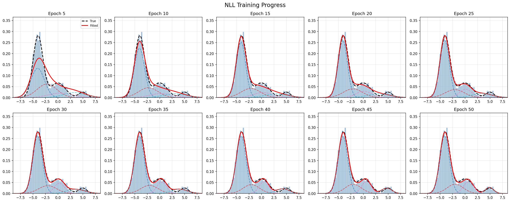

* NL

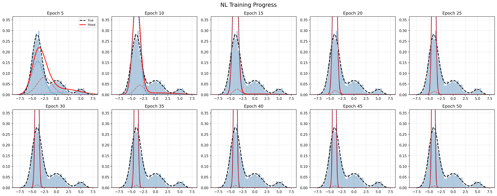

* SE

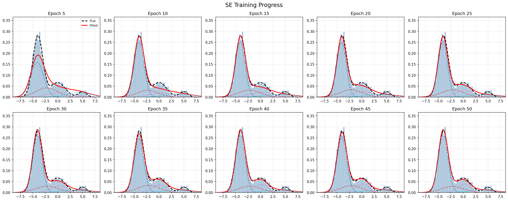

* SE after 200 epochs

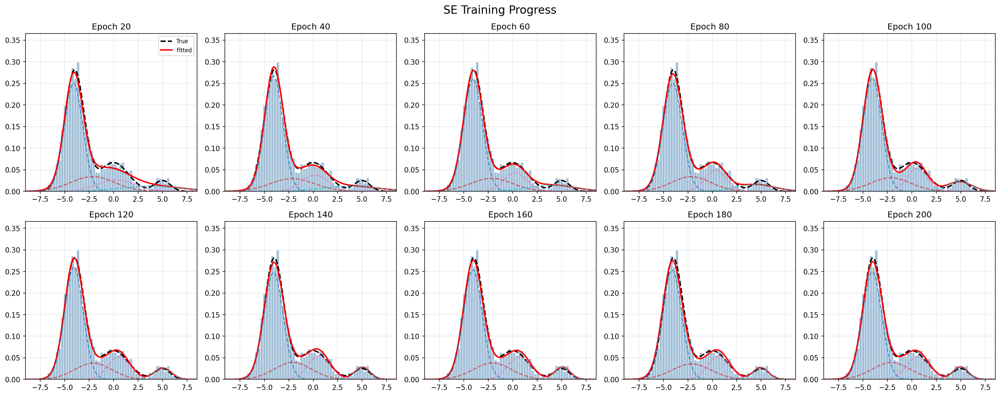

* MixCE ($\eta$=0.5)

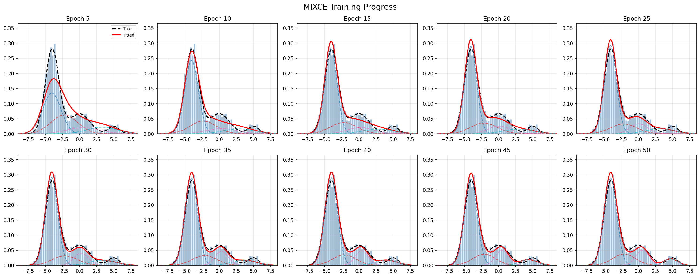

* MixCE ($\eta$=0.3)

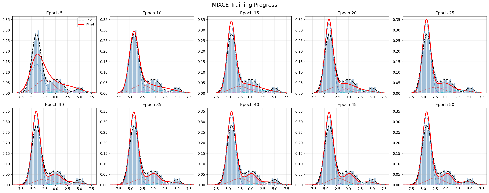


* TrSFT ($\alpha$=0.03)

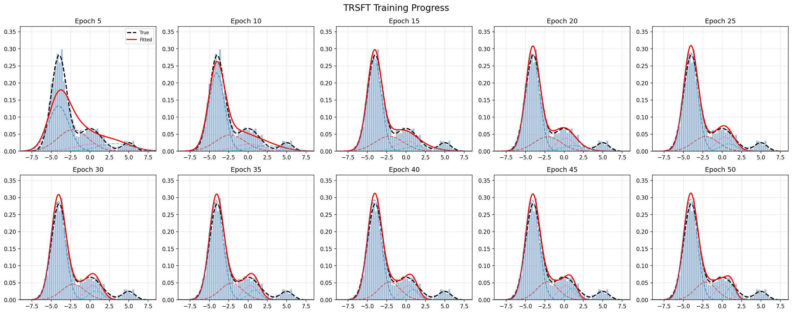

* TrSFT ($\alpha$=0.05)

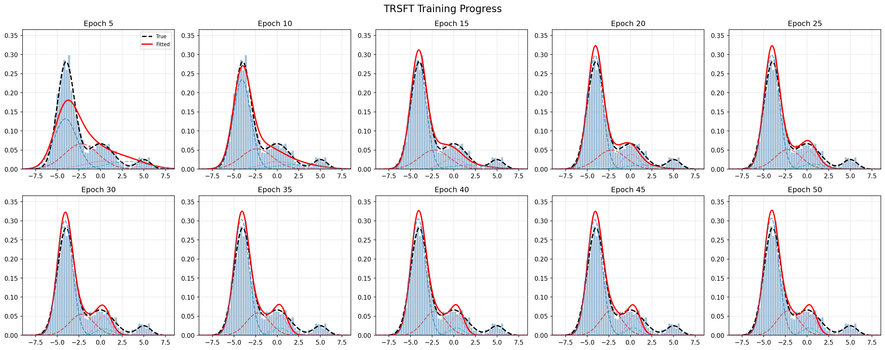

* REINFORCE

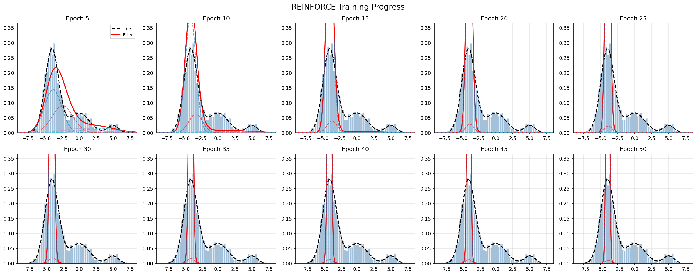


**Things that are worth noting**:

1. NLL is overall the best performing objective. NLL both efficiently and perfectly fits the data.

2. SE is less efficient than NLL. SE can also perfectly fits the data after many epochs.

3. Both NL and REINFORCE leads to model collapse.

4. MixCE and TrSFT show slightly different non-collapsing mode-seeking behaviors.


#### Under-specification
In this setup, data is sampled from a **4-mode** GMM, while the model we train is **3-mode**. You may want to focus on this setup if you believe the currect transformer-based LLM is *not* capable enough for modeling human language.

* NLL

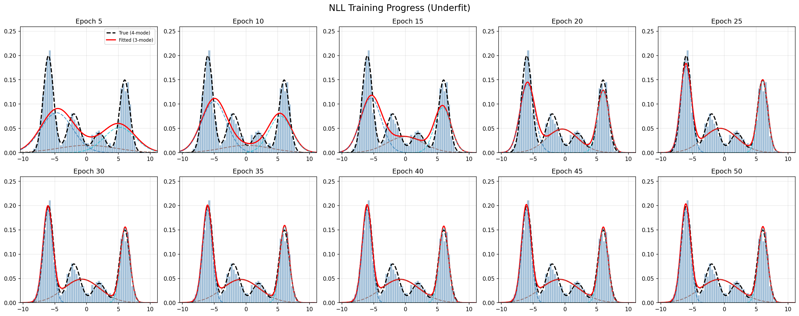

* NL

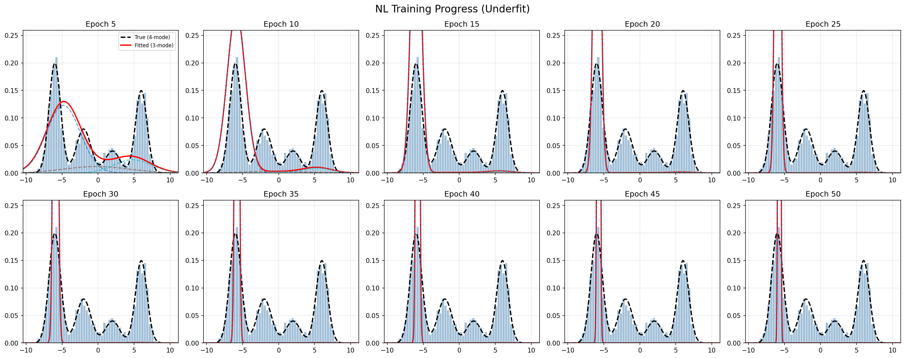

* SE

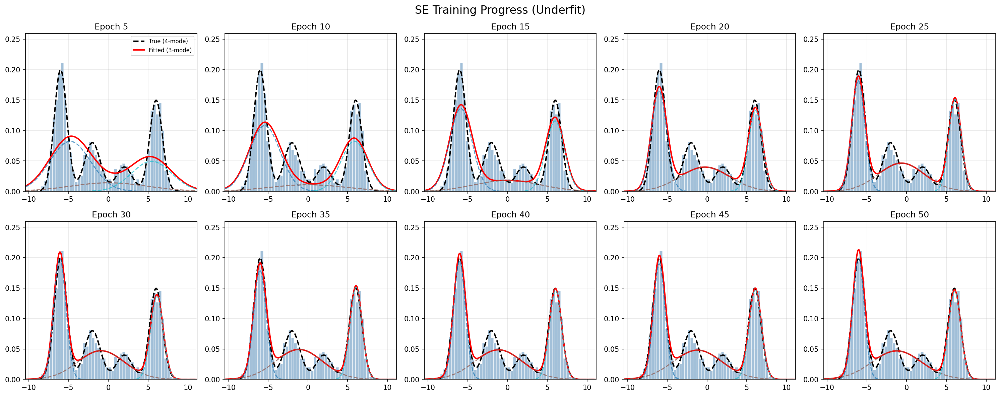

* MixCE ($\eta$=0.5)

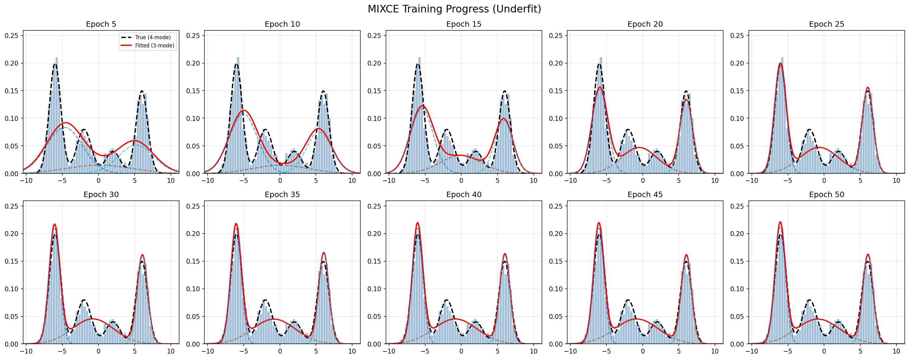

* MixCE ($\eta$=0.3)

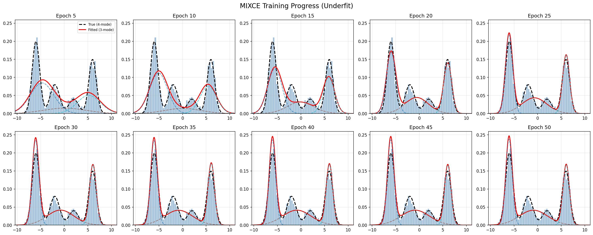


* TrSFT ($\alpha$=0.03)

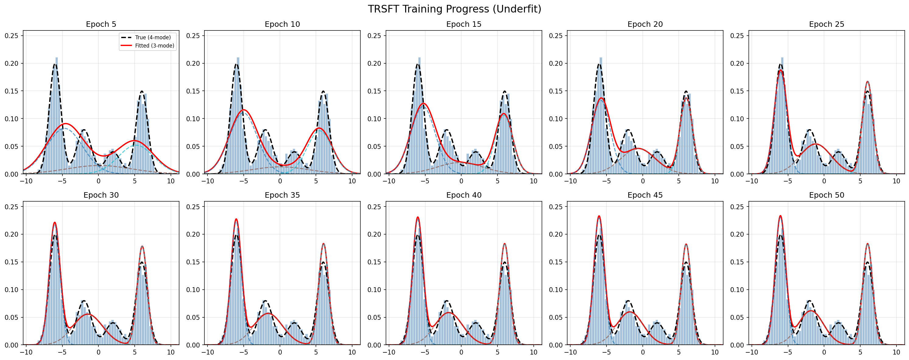

* TrSFT ($\alpha$=0.05)


* REINFORCE

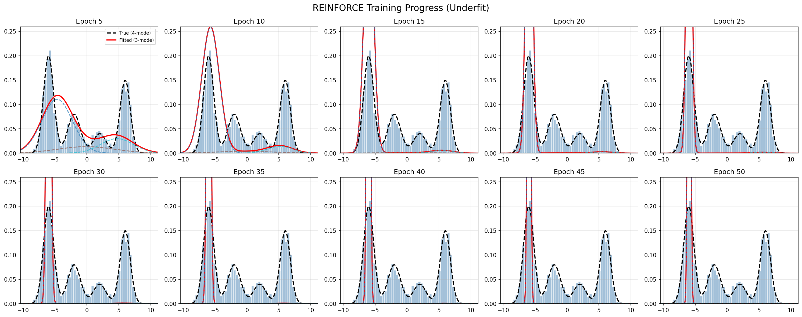


What we observed in the under-specification setup **still hold**.

**Two more things that are worth noting**:

1. NLL is mode covering, which might be undesirable. For example, it is more likely to get $x=0$ from the learned model than from the data.

2. TrSFT is particularly good at fitting into a subset of modes of the data.

**Overall**, I don't see big issues with using NLL for model training. In fact, it is the best performing objective in general. If you really want to minimizing the possibility of getting *unnatual* samples from the model (i.e., samples that are unlikely to get from the data), you may want to swap to TrSFT, but keep in the mind that it comes with the cost of diversity.


### Post-training


Here we start with the model pre-trained by **NLL**, and then we fine-tune the model on data samples from a new mode of data, mimicking finetuning a pre-trained language model on a certain task or domain.

#### Over-specification

Post-training data is from a new 4th mode (highlighted in yellow in figures). The black dash line (**-- True**) shows the unweighted joint distribution of the original 3-mode data and the new 4th mode.

* NLL


* NL

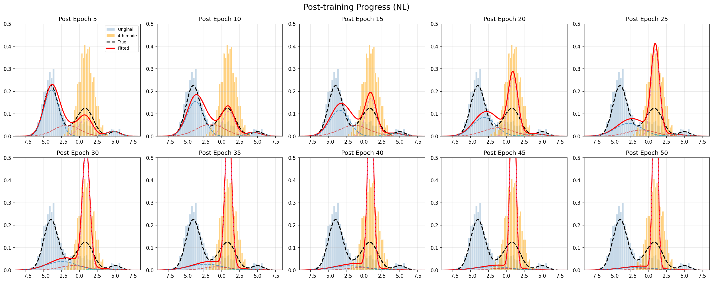

* SE

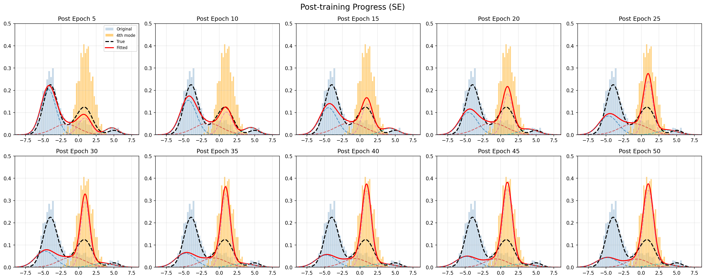

* MixCE ($\eta$=0.5)

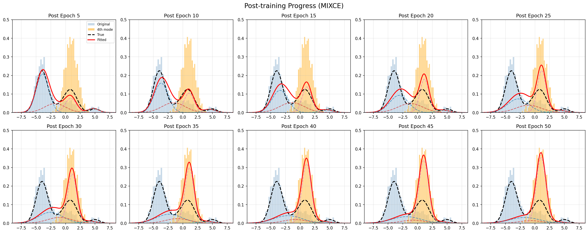


* TrSFT ($\alpha$=0.03)

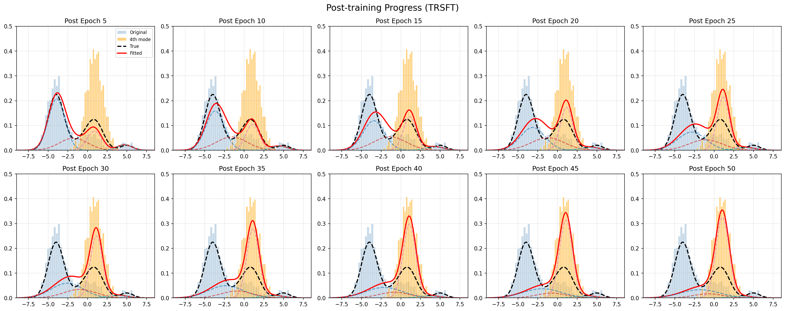


* REINFORCE

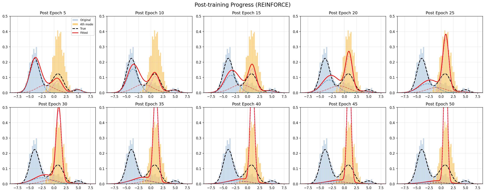

**Things that are worth noting**:

1. Forgetting is inevitable. No matter how the model is pretrained and which post-training objective is being used, the model will eventually fit into the new single-mode data distribution.

2. NL and REINFORCE forget faster. Due to the strong mode-seeking tendency, NL and REINFORCE fits into the new single-mode data quicker compared to other objectives.

3. Compared to NLL, SE forgets slightly slower, probably due to its inefficiency.

**My reflection on model forgetting**:

Continual learning is an appealing concept. I have always imagined that LLMs could behave like humans (or perhaps superhumans), acquiring new knowledge without forgetting what they have already learned. However, if we simply train a model with NLL on a stream of new data, there is no mechanism to prevent forgetting. This is because NLL always pushes the model to fit the current data distribution, regardless of what it previously learned.

Of course, we can mitigate forgetting to some extent—by using SE, reducing the learning rate, or stopping training early. But these approaches do not fundamentally solve the problem; they merely slow learning down, making it less efficient rather than truly continual.

This leads to a more fundamental question that must be answered before we can meaningfully discuss continual learning: what is the target model distribution we actually want to converge to?

If the goal is the unweighted joint distribution of all past data plus new data, then, in principle (albeit expensively), we can always mix old and new data and retrain the model from scratch. If instead we want to place higher weight on newer data, then we must explicitly define the acceptable forgetting scheme. Only once this is specified can we meaningfully design training methods that produce the desired behavior.

### NLL vs NL for real LLM training

The NL objective is **infeasible** for real LLM training because the likelihood of a token sequence is the product of token-level probabilities, which underflows in practice. While the log-likelihood can be cleanly decomposed into a sum of token-level log-likelihoods, no such decomposition exists for the likelihood itself.

That said, if we momentarily set aside mathematical rigor, we can still formulate an approximate objective by minimizing the negative likelihood at each time step $t$, i.e., minimizing a sum of token-level negative likelihoods:

$$-\mathbb{E}\_{x_i \sim p}[\sum_t \nabla_\theta q_\theta(x_i^t | x_i^{\lt t})]$$

This is exactly the approach taken in [On the Generalization of SFT](https://arxiv.org/pdf/2508.05629) and [MixCE](https://arxiv.org/pdf/2305.16958).

I do not yet have a precise understanding of how this token-level approximation relates to the true sequence-level likelihood. However, if we accept it as a “reasonable” proxy for NL, it becomes possible to run large-scale, practical LLM training.

Using this formulation, I conducted continued pre-training of the Qwen-3-4B model on the [Pile of Law]((https://huggingface.co/datasets/pile-of-law/pile-of-law)) dataset. I evaluated checkpoints on three general NLP benchmarks: MMLU, HellaSwag, and Winogrande. The results show that training with NL leads to rapid “forgetting,” manifested as a sharp drop in performance on general NLP tasks, whereas NLL remains relatively stable.

Naturally, with a sufficiently large learning rate or extended training, NLL will also induce some degree of forgetting as the model adapts more strongly to the legal domain. However, this effect will not be as destructive as NL.

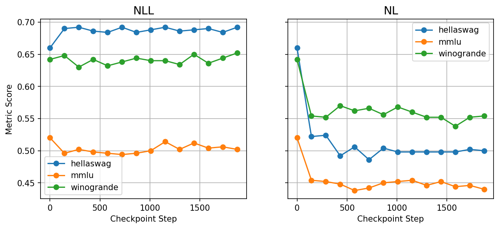


